# Power Platform Enterprise Policies PowerShell Scripts

These scripts automate managing (create, update, get, delete) Power Platform Enterprise Policies as Azure resources.</br>
In addition, we are providing sample scripts on how to associate these policies with Power Platform environments.</br>
Please note that these scripts are provided under MIT license and its usage is the sole responsibility of the user.

## How to run setup scripts

1. **Install modules script** : This script installs the required modules to run Enterprise Policies scripts.</br>
Script name: [InstallPowerAppsCmdlets.ps1](./Source/InstallPowerAppsCmdlets.ps1)</br>
    * Run the script to import required PowerShell modules.

2. **Setup Azure subscription for Microsoft.PowerPlatform** : This script registers the Azure subscription for Microsoft.PowerPlatform resource provider
and also allow lists the subscription for enterprisePoliciesPreview feature.</br>
Script name: [SetupSubscriptionForPowerPlatform.ps1](./Source/SetupSubscriptionForPowerPlatform.ps1)</br>
    * Run the script to setup Azure subscription for Microsoft.PowerPlatform resources

## How to run CMK scripts

The CMK scripts are present in folder [Cmk](./Source/Cmk/) at current location

### Create CMK Enterprise policy
1. **Create CMK Enterprise Policy** : This script creates a CMK enterprise policy</br>
Script name : [CreateCMKEnterprisePolicy.ps1](./Source/Cmk/CreateCMKEnterprisePolicy.ps1)</br>
Input parameters :
    - subscriptionId : The subscriptionId where CMK enterprise policy needs to be created
    - resourceGroup : The resource group where CMK enterprise policy needs to be created
    - enterprisePolicyName : The name of the CMK enterprise policy resource
    - enterprisePolicyLocation : The Azure geo where CMK enterprise policy needs to be created. Example: unitedstates, europe, australia.</br>
      To get the complete supported locations for enterprise policy, below command can be used:</br>
      ((Get-AzResourceProvider -ProviderNamespace Microsoft.PowerPlatform).ResourceTypes | Where-Object ResourceTypeName -eq enterprisePolicies).Locations
    - keyVaultId : The ARM resource ID of the key vault used for CMK
    - keyName : The name of the key in the key vault used for CMK
    - keyVersion: The version of the key in the key vault used for CMK

Sample Input :</br>
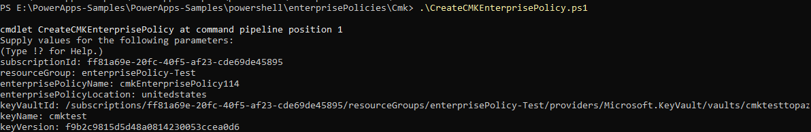</br>

Sample Output : </br>
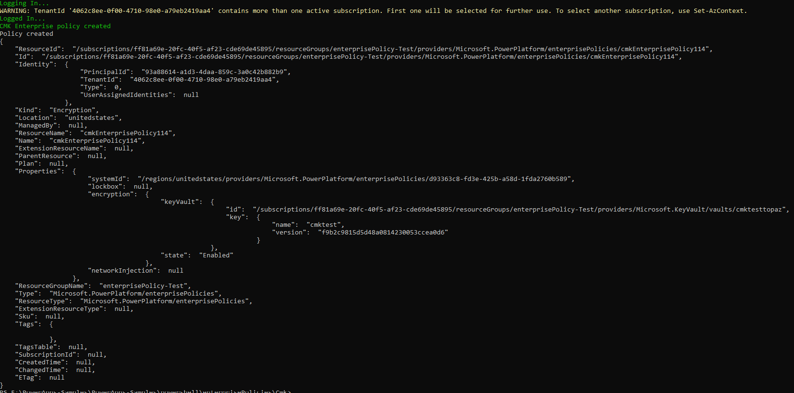</br>

### Get CMK Enterprise Policy By ResourceId
2. **Get CMK Enterprise Policy By ResourceId** : The script gets a CMK enterprise policy by ARM resourceId</br>
Script name : [GetCMKEnterprisePolicyByResourceId.ps1](./Source/Cmk/GetCMKEnterprisePolicyByResourceId.ps1)</br>
Input parameter :
    - enterprisePolicyArmId : The ARM resource ID of the CMK Enterprise Policy

Sample Input :</br>
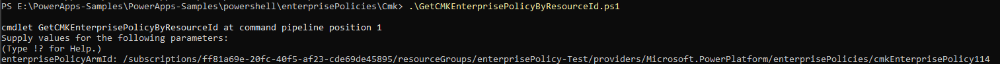</br>

Sample Output :</br>
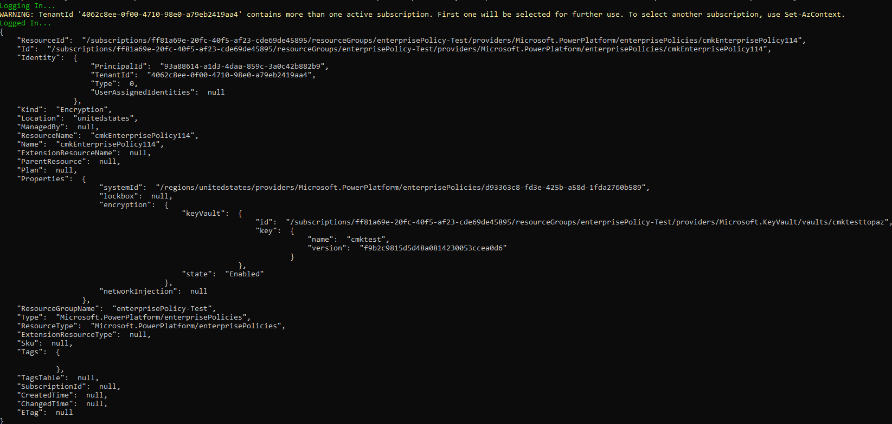</br>

### Get CMK Enterprise Policies in Subscription
3. **Get CMK Enterprise Policies in Subscription** : The script gets all CMK enterprise policies in an Azure subscription</br>
Script name : [GetCMKEnterprisePoliciesInSubscription.ps1](./Source/Cmk/GetCMKEnterprisePoliciesInSubscription.ps1)</br>
Input parameter :
    - subscriptionId: : The Azure subscription Id

Sample Input :</br>
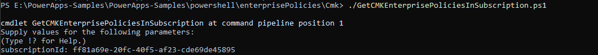</br>

Sample Output :</br>
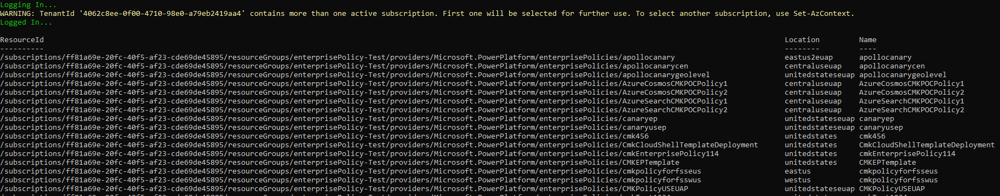</br>

### Get CMK Enterprise Policies in Resource Group
4. **Get CMK Enterprise Policies in Resource Group** : The script gets all CMK enterprise policies in an Azure resource group</br>
Script name : [GetCMKEnterprisePoliciesInResourceGroup.ps1](./Source/Cmk/GetCMKEnterprisePoliciesInResourceGroup.ps1)</br>
Input parameters :
    - subscriptionId : The Azure subscription Id
    - resourceGroup : The Azure resource group

Sample Input : </br>
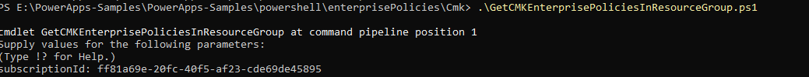</br>

Sample Output :</br>
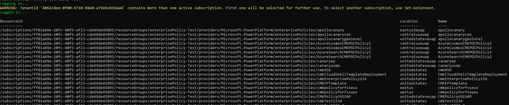</br>

### Validate Azure Key Vault
5. **Validate Azure Key Vault** : This script checks if the Key Vault is setup correctly according to the pre-requisites required by the Power Platform CMK Enterprise Policy. For details please follow the setup instructions at https://learn.microsoft.com/power-platform/admin/customer-managed-key#create-encryption-key-and-grant-access</br>
	Following major validations are performed:
    - Soft-delete is enabled for key vault: Please follow the instructions at </br>
      https://learn.microsoft.com/azure/key-vault/general/soft-delete-change to update the soft delete property.
    - Purge protection is enabled for key vault: Please follow the istructions at </br>
	  https://learn.microsoft.com/azure/key-vault/general/key-vault-recovery?tabs=azure-portal to get details about enabling Purge Protection</br>
	- "Key Vault Crypto Service Encryption User" role assignment is present for the given enterprise policy if key vault permission model is Azure role based access control.</br>
    - Access policies of GET, UNWRAPKEY, WRAPKEY are added to the key vault for the given enterprise policy if key vault permission model is vault access policy.</br>
	- Key configured for the given enterprise policy is present, enabled, activated and not expired.</br>
	 

Script name : [ValidateKeyVaultForCMK.ps1](./Source/Cmk/ValidateKeyVaultForCMK.ps1)</br>
Input parameters:
- subscriptionId : The Azure subscription Id of the Key Vault
- keyVaultName : The name of the key Vault
- enterprisePolicyArmId : The CMK enterprise policy ARM Id 

Sample Input : </br>
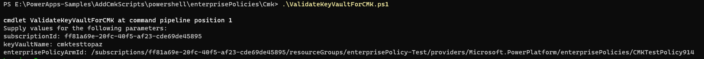</br>

Sample Output :</br>
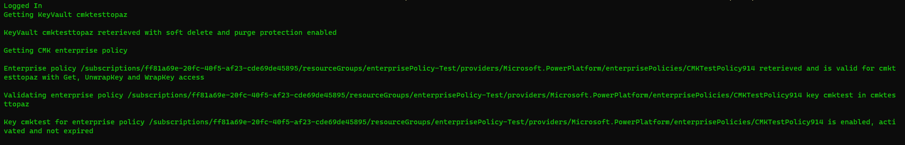</br>

### Update CMK Enterprise Policy
6. **Update CMK Enterprise Policy** : This script updates a CMK Enterprise Policy. The updates allowed are for keyVaultId, keyName, keyVersion.</br>
If you are changing only some of the allowed parameter values, provide “N/A” when prompted for the parameters that you don’t want to change.</br>
 **If the enterprise policy is associated with one or more environments, the update operation will fail, and the script will return an error.**</br>
Script name : [UpdateCMKEnterprisePolicy.ps1](./Cmk/UpdateCMKEnterprisePolicy.ps1)</br>
Input parameters :
    - subscriptionId : The Azure subscription Id of the CMK Enterprise Policy
    - resourceGroup : The Azure resource group of the CMK Enterprise Policy
    - enterprisePolicyName : The name of the CMK enterprise policy that needs to be updated
    - keyVaultId : The ARM resource ID of the key vault if it needs to be updated. Provide "N/A" if update is not required for key vault Id
    - keyName: The name of the key if it needs to be updated. Provide "N/A" if update is not required for name of the key
    - keyVersion: The version of the key if it needs to be updated. Provide "N/A" if update is not required for version of the key

Sample Input : </br>
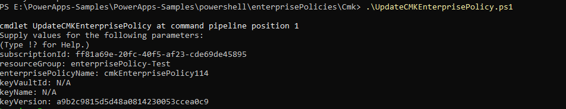</br>

Sample Output :</br>
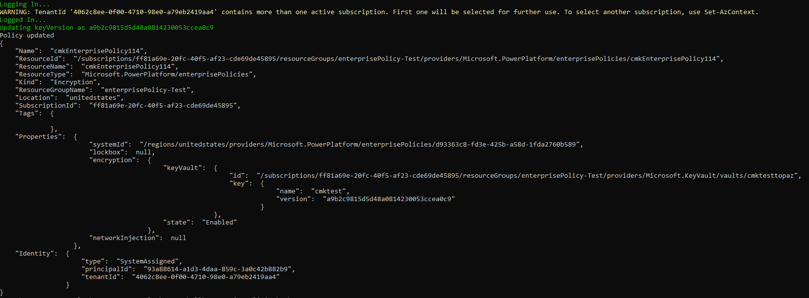</br>

### Delete CMK Enterprise Policy
7. **Delete CMK Enterprise Policy** : This script deletes the CMK Enterprise Policy for a given policy Id. </br>
**If the CMK enterprise policy is associated with one or more environments, the delete operation will fail, and the script will return an error.**</br>
Script name : [RemoveCMKEnterprisePolicy.ps1](./Source/Cmk/RemoveCMKEnterprisePolicy.ps1)</br>
Input parameter :
    - policyArmId : The ARM ID of the CMK enterprise policy to be deleted

Sample Input : </br>
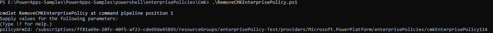</br>

Sample Output :</br>
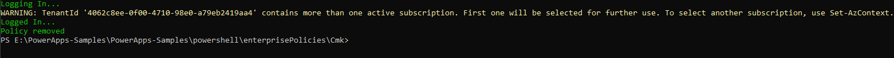</br>

### Set CMK for an environment
8. **Set CMK for an environment** : This script applies a CMK enterprise policy to a given Power Platform environment.</br>
The script adds the environment to the enterprise policy and optionally polls for the operation outcome.</br>
Script name : [AddCustomerManagedKeyToEnvironment.ps1](./Cmk/AddCustomerManagedKeyToEnvironment.ps1)</br>
Input parameters :
    - environmentId : The Power Platform environment ID
    - policyArmId : The ARM ID of the CMK Enterprise Policy

Sample Input :</br>
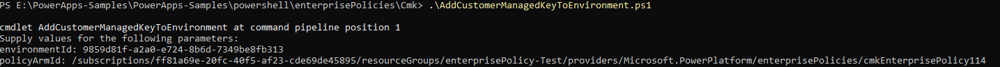</br>

Sample Output :</br>
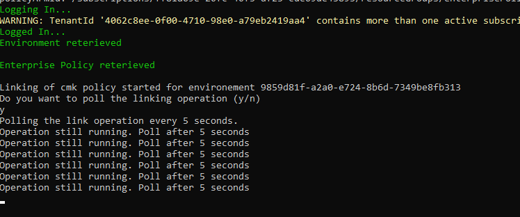</br>

### Get CMK for an environment
9. **Get CMK for an environment** : This script returns the CMK enterprise policy if applied to a given Power Platform environment.</br>
Script name : [GetCMKEnterprisePolicyForEnvironment.ps1](./Source/Cmk/GetCMKEnterprisePolicyForEnvironment.ps1)</br>
Input parameter :
    - environmentId : The Power Platform environment ID

Sample Input :</br>
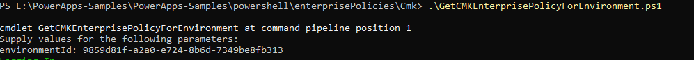</br>

Sample Output :</br>
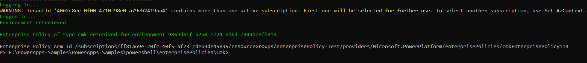</br>

### Remove CMK from an environment
10. **Remove CMK from an environment** : The script removes the CMK enterprise policy from an environment, </br>
which results on data to be encrypted with a Microsoft managed encryption key.</br>
Script name : [RemoveCustomerManagedKeyFromEnvironment.ps1](./Source/Cmk/RemoveCustomerManagedKeyFromEnvironment.ps1)</br>
Input parameters :
    - environmentId : The Power Platform environment ID
    - policyArmId: The ARM ID of the CMK Enterprise Policy

Sample Input :</br>
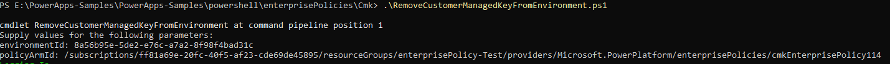</br>

Sample Output :</br>
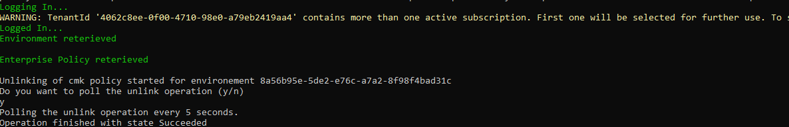</br>

## How to run Subnet Injection scripts

The Subnet Injection scripts are present in folder [SubnetInjection](./Source/SubnetInjection/) at current location

### 1. **Setup virtual network for Subnet Injection**

Use the `New-VnetForSubnetDelegation` cmdlet to create a new virtual network with subnet delegation or add delegation to an existing virtual network and subnet for `Microsoft.PowerPlatform/enterprisePolicies`.

**Example 1: Configure existing VNet and subnet**
```powershell
New-VnetForSubnetDelegation `
    -SubscriptionId "12345678-1234-1234-1234-123456789012" `
    -VirtualNetworkName "existing-vnet" `
    -SubnetName "existing-subnet" `
    -ResourceGroupName "myResourceGroup"
```

**Example 2: Create new VNet with subnet and delegation**
```powershell
New-VnetForSubnetDelegation `
    -SubscriptionId "12345678-1234-1234-1234-123456789012" `
    -VirtualNetworkName "wus-vnet" `
    -SubnetName "default" `
    -CreateVirtualNetwork `
    -AddressPrefix "10.0.0.0/16" `
    -SubnetPrefix "10.0.1.0/24" `
    -ResourceGroupName "myResourceGroup" `
    -Region "westus" `
    -TenantId "00000000-0000-0000-0000-000000000000"
```

**NOTE**: This can also be achieved through Azure portal. More documentation on subnet delegation [here](https://learn.microsoft.com/en-us/azure/virtual-network/manage-subnet-delegation?tabs=manage-subnet-delegation-portal#delegate-a-subnet-to-an-azure-service)

### 2. **Create Subnet Injection Enterprise Policy** 
This script creates a Subnet Injection enterprise policy</br>
Script name : [CreateSubnetInjectionEnterprisePolicy.ps1](./Source/SubnetInjection/CreateSubnetInjectionEnterprisePolicy.ps1)</br>
Input parameters :
- subscriptionId : The subscriptionId where Subnet Injection enterprise policy needs to be created
- resourceGroup : The resource group where Subnet Injection enterprise policy needs to be created
- enterprisePolicyName : Designate a name for the Subnet Injection enterprise policy
- enterprisePolicyLocation : The Azure geo where Subnet Injection enterprise policy needs to be created.
    * Example: unitedstates, europe, australia, uk</br>
    * To get the complete list of supported geos for enterprise policy, use the following command:</br>
        ```powershell
        ((Get-AzResourceProvider -ProviderNamespace Microsoft.PowerPlatform).ResourceTypes | Where-Object ResourceTypeName -eq enterprisePolicies).Locations
        ```
- primaryVnetId : The ARM resource ID of the primary virtual network to be used for Subnet Injection
- primarySubnetName : The name of the subnet in the primary virtual network to be used for Subnet Injection
- secondaryVnetId : The ARM resource ID of the secondary virtual network to be used for Subnet Injection
    * can put `N/A` for geo's with only 1 supported region, must be provided for geos with 2+ supported regions
- secondarySubnetName : The name of the subnet in the secondary virtual network to be used for Subnet Injection
    * can put `N/A` for geo's with only 1 supported region, must be provided for geos with 2+ supported regions

**NOTE**:
* :exclamation: If there are more than 1 supported regions for the geo outlined in the [list of supported regions](https://learn.microsoft.com/en-us/power-platform/admin/vnet-support-overview#supported-regions), the primary and secondary VNet must have been created in ***different*** regions in the geo
* :exclamation: To delete a Subnet Injection enterprise policy:
    * ["Remove Subnet Injection from an environment"](#9-remove-subnet-injection-from-an-environment) for **ALL** associated environments, the following remove command should error and call out if there are environments still associated
    * Run the following command (see the "Get Subnet Injection Enterprise Policy" scripts if needed to find the ARM Resource ID):
        ```powershell
        Remove-AzResource -ResourceId $policyArmId -Force
        ```

Sample Input :</br>
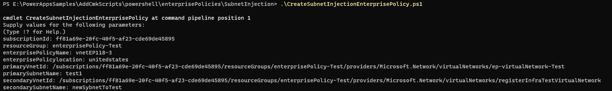</br>

Sample Output : </br>
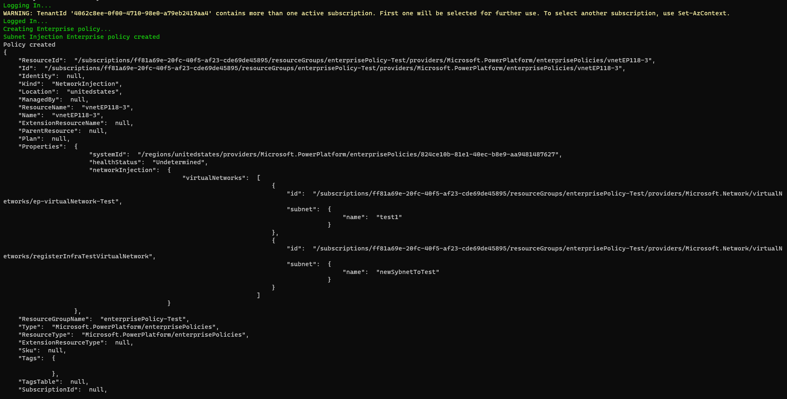</br>

### 3. **Get Subnet Injection Enterprise Policy By ResourceId**
This script gets a Subnet Injection enterprise policy by ARM resourceId</br>
Script name : [GetSubnetInjectionEnterprisePolicyByResourceId.ps1](./Source/SubnetInjection/GetSubnetInjectionEnterprisePolicyByResourceId.ps1)</br>
Input parameter :
- enterprisePolicyArmId : The ARM resource ID of the Subnet Injection Enterprise Policy

Sample Input :</br>
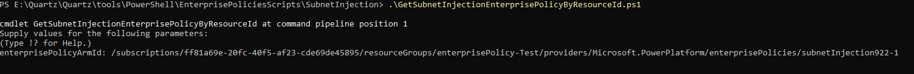</br>

Sample Output :</br>
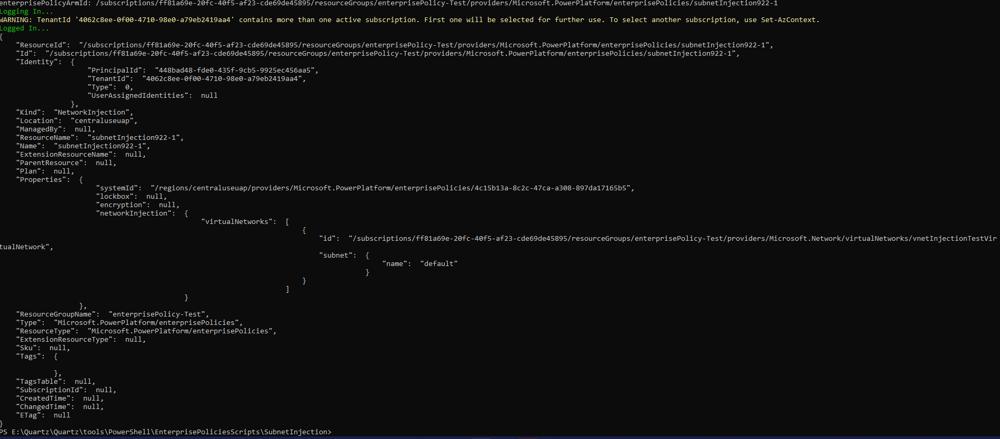</br>

### 4. **Get Subnet Injection Enterprise Policies in Subscription** 
This script gets all Subnet Injection enterprise policies in an Azure subscription</br>
Script name : [GetSubnetInjectionEnterprisePoliciesInSubscription.ps1](./Source/SubnetInjection/GetSubnetInjectionEnterprisePoliciesInSubscription.ps1)</br>
Input parameter :
- subscriptionId: : The Azure subscription Id

Sample Input :</br>
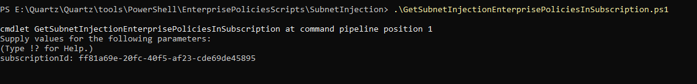</br>

Sample Output :</br>
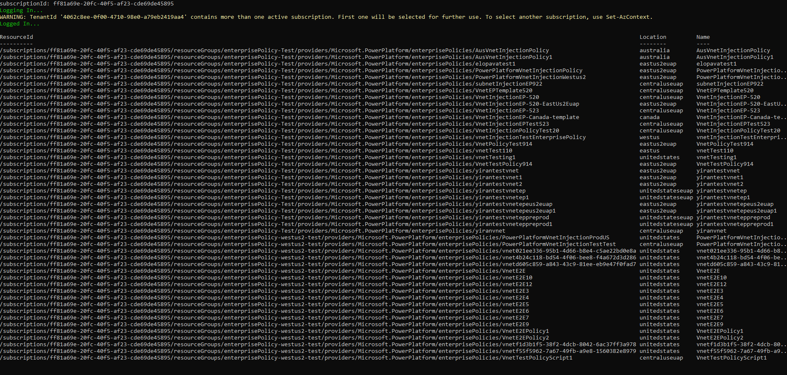</br>

### 5. **Get Subnet Injection Enterprise Policies in Resource Group**
This script gets all Subnet Injection enterprise policies in an Azure resource group</br>
Script name : [GetSubnetInjectionEnterprisePoliciesInResourceGroup.ps1](./Source/SubnetInjection/GetSubnetInjectionEnterprisePoliciesInResourceGroup.ps1)</br>
Input parameters :
- subscriptionId : The Azure subscription Id
- resourceGroup : The Azure resource group

Sample Input : </br>
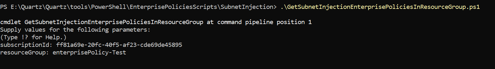</br>

Sample Output :</br>
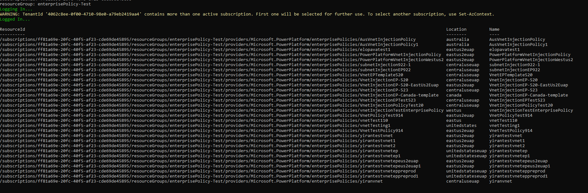</br>

### 6. **Update Subnet Injection Enterprise Policy**
This script updates a Subnet Injection Enterprise Policy. The updates allowed are for primary/secondary virtual network Id and/or primary/secondary subnet name.</br>
If you are changing only some of the allowed parameter values, provide “N/A” when prompted for the parameters that you don’t want to change.</br>
 **If the enterprise policy is associated with one or more environments, the update operation will fail, and the script will return an error.**</br>
Script name : [UpdateSubnetInjectionEnterprisePolicy.ps1](./Source/SubnetInjection/UpdateSubnetInjectionEnterprisePolicy.ps1)</br>
Input parameters :
- subscriptionId : The Azure subscription Id of the Subnet Injection Enterprise Policy
- resourceGroup : The Azure resource group of the Subnet Injection Enterprise Policy
- enterprisePolicyName : The name of the Subnet Injection enterprise policy that needs to be updated
- primaryVnetId : The ARM resource ID of the primary virtual network if it needs to be updated. Provide "N/A" if update is not required for the primary virtual network Id
- primarySubnetName: The name of the subnet in the primary virtual network if it needs to be updated. Provide "N/A" if update is not required for name of the subnet in the primary virtual network
- secondaryVnetId : The ARM resource ID of the secondary virtual network if it needs to be updated. Provide "N/A" if update is not required for the secondary virtual network Id
- secondarySubnetName: The name of the subnet in the secondary virtual network if it needs to be updated. Provide "N/A" if update is not required for name of the subnet in the secondary virtual network

Sample Input : </br>
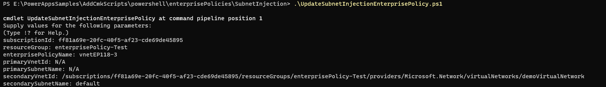</br>

Sample Output :</br>
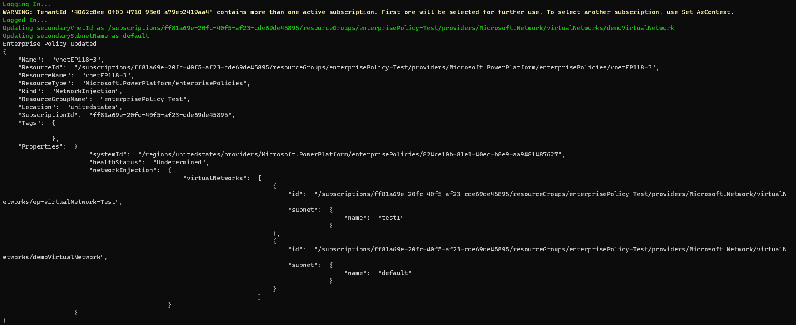</br>

### 7. **Set Subnet Injection for an environment**
This script applies a Subnet Injection enterprise policy to a given Power Platform environment.</br>
The script adds the environment to the enterprise policy and optionally polls for the operation outcome.</br>
Script name : [NewSubnetInjection.ps1](./Source/SubnetInjection/NewSubnetInjection.ps1)</br>
Input parameters :
- environmentId : The Power Platform environment ID
- policyArmId : The ARM ID of the Subnet Injection Enterprise Policy

Sample Input :</br>
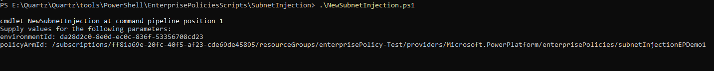</br>

Sample Output :</br>
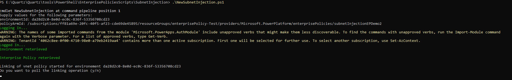</br>

### 8. **Get Subnet Injection for an environment**
This script returns the Subnet Injection enterprise policy if applied to a given Power Platform environment.</br>
Script name : [GetSubnetInjectionEnterprisePolicyForEnvironment.ps1](./Source/SubnetInjection/GetSubnetInjectionEnterprisePolicyForEnvironment.ps1)</br>
Input parameter :
- environmentId : The Power Platform environment ID

Sample Input :</br>
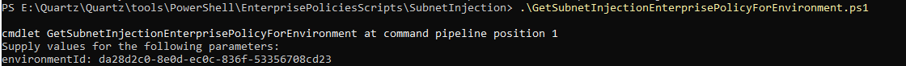</br>

Sample Output :</br>
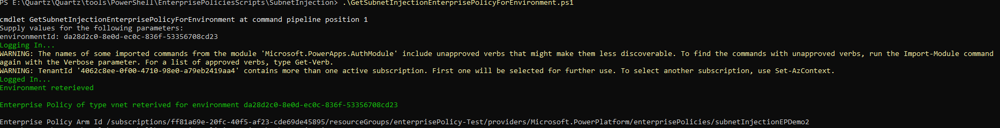</br>

### 9. **Remove Subnet Injection from an environment**
This script removes the Subnet Injection enterprise policy from an environment, </br>
Script name : [RevertSubnetInjection.ps1](./Source/SubnetInjection/RevertSubnetInjection.ps1)</br>
Input parameters :
- environmentId : The Power Platform environment ID
- policyArmId: The ARM ID of the Subnet Injection Enterprise Policy

Sample Input :</br>
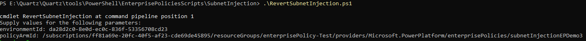</br>

Sample Output :</br>
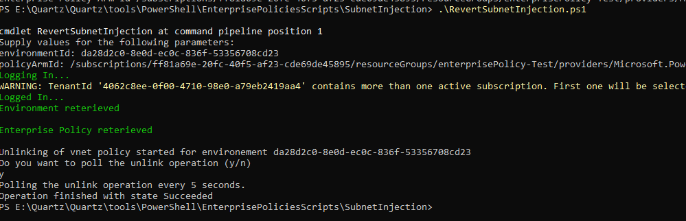</br>


## Using the Subnet Injection Diagnostic Module

The diagnostic commands are designed to help troubleshoot issues with the VNET functionality provided by Power Platform. They can be run in both Windows PowerShell and PowerShell Core environments.

You can get the module in two different ways. Either through the PowerShell Gallery or by downloading the module from Github Releases. Both options provide the same functionality.

### Install the module from the PS Gallery

In a PowerShell session, run the following command the first time you open the PowerShell session:

```powershell
Install-Module -Name Microsoft.PowerPlatform.EnterprisePolicies
Import-Module Microsoft.PowerPlatform.EnterprisePolicies
```

This will import the module, validate prerequisites and make the functions available for use. If you are missing any prerequisites, the module will inform you and ask for permission to install them.

### Download the module from Github Releases

Go to the [Releases](https://github.com/microsoft/PowerPlatform-EnterprisePolicies/releases/latest) page and download the latest release zip file. Extract the contents to a local directory.

Navigate to the extracted directory and run the following command the first time you open the PowerShell session:

```powershell
Import-Module .\Microsoft.PowerPlatform.EnterprisePolicies
```

This will import the module, validate prerequisites and make the commands available for use. If you are missing any prerequisites, the module will inform you and ask for permission to install them.

### Permissions required

In order to run these diagnostics commands the user used to invoke the commands must have the Power Platform Administrator role.

To validate that the role is correctly assigned you can use the `Test-AccountPermissions` command.

### Running the diagnostic functions

Once your module has been imported into your PowerShell session, you can now run the diagnostic functions as needed. For example, to run the `Get-EnvironmentUsage` function, you would use:

```powershell
Get-EnvironmentUsage -EnvironmentId "your-environment-id"
```

For a full list of available functions and their usage, you can refer to the help documentation by checking out the [EnterprisePolicies Docs](./docs/en-US/EnterprisePolicies) folder.

### Forcing re-authentication

By default, the diagnostic functions will attempt to reuse an existing Azure session if one is available. If you want to manually choose which account to use instead of letting the module automatically select one, you can pass the `-ForceAuth` switch to any of the diagnostic functions:

```powershell
Get-EnvironmentUsage -EnvironmentId "your-environment-id" -ForceAuth
```

This will prompt you to re-authenticate, allowing you to select or enter the credentials for the account you want to use.

## Development

To get started with development, clone the repository and open it in VSCode. The scripts are written in PowerShell and follow standard PowerShell conventions.

Please place any common functions in the `Private` folder, and any module-level functions that are going to be exposed in the `Public` folder.

In order to run tests, please ensure you do the following from the repository root:

```powershell
# You might need the --interactive flag
dotnet restore
```

> [!NOTE]
> If you are not a Microsoft employee, you will need to modify the Nuget.config file to point to the public NuGet repository.

Then, you can enable running the tests by going to the Run and Debug view in VSCode and selecting and running the `Load Modules` script. This will load the necessary modules and allow you to run the tests.

> [!NOTE]
> You should clear out any Pester installations, as the tests are written using the latest version of Pester.

## FAQ

### General FAQ

#### Unable to add/remove EP to/from environment due to "Error getting environment"
* StatusCode: 404 
* ErrorMessage contains: *The environment '\<guid\>' could not be found in the tenant...*
* **Solution**: Ensure the user has the `Power Platform Administrator` (or equivalent) role

### Subnet Injection FAQ

#### Unable to delete VNet / Unable to modify subnet
* ErrorCode: `InUseSubnetCannotBeDeleted` or `SubnetMissingRequiredDelegation`
* ErrorMessage contains: *.../serviceAssociationLinks/PowerPlatformServiceLink...*
* **Solution**: delete the Subnet Injection enterprise policy first, see the notes section in ["Create subnet injection enterprise policy"](#2-create-subnet-injection-enterprise-policy)
