# Power Platform Enterprise Policies PowerShell Scripts

These scripts automate managing (create, update, get, delete) Power Platform Enterprise Policies as Azure resources.</br>
In addition, we are providing sample scripts on how to associate these policies with Power Platform environments.</br>
Please note that these scripts are provided under MIT license and its usage is the sole responsibility of the user.

## Subnet Injection Users

The legacy standalone subnet injection scripts have been replaced by the **Microsoft.PowerPlatform.EnterprisePolicies** PowerShell module. See [Using the Power Platform Enterprise Policies Module](#using-the-power-platform-enterprise-policies-module) below for setup instructions.

For subnet injection-specific commands, see:
- [New-SubnetInjectionEnterprisePolicy](./docs/en-US/Microsoft.PowerPlatform.EnterprisePolicies/New-SubnetInjectionEnterprisePolicy.md)
- [Get-SubnetInjectionEnterprisePolicy](./docs/en-US/Microsoft.PowerPlatform.EnterprisePolicies/Get-SubnetInjectionEnterprisePolicy.md)
- [Remove-SubnetInjectionEnterprisePolicy](./docs/en-US/Microsoft.PowerPlatform.EnterprisePolicies/Remove-SubnetInjectionEnterprisePolicy.md)
- [New-VnetForSubnetDelegation](./docs/en-US/Microsoft.PowerPlatform.EnterprisePolicies/New-VnetForSubnetDelegation.md)

For diagnostics, see: [Get-EnvironmentUsage](./docs/en-US/Microsoft.PowerPlatform.EnterprisePolicies/Get-EnvironmentUsage.md), [Test-DnsResolution](./docs/en-US/Microsoft.PowerPlatform.EnterprisePolicies/Test-DnsResolution.md), [Test-NetworkConnectivity](./docs/en-US/Microsoft.PowerPlatform.EnterprisePolicies/Test-NetworkConnectivity.md)

## Using the Power Platform Enterprise Policies Module

The Microsoft.PowerPlatform.EnterprisePolicies module is a new module that aims to simplify the management and creation of enterprise policies. It additionally, contains some diagnostic tooling specific for subnet injection scenarios. For a full list of commands that are available and its respective documentation see [Microsoft.PowerPlatform.EnterprisePolicies](./docs/en-US/Microsoft.PowerPlatform.EnterprisePolicies/Microsoft.PowerPlatform.EnterprisePolicies.md)

### Install the module from the PS Gallery

In a PowerShell session, run the following command the first time you open the PowerShell session:

```powershell
Install-Module -Name Microsoft.PowerPlatform.EnterprisePolicies
Import-Module Microsoft.PowerPlatform.EnterprisePolicies
```

This will import the module, validate prerequisites and make the functions available for use. If you are missing any prerequisites, the module will inform you and ask for permission to install them.

### Download the module from Github Releases

Go to the [Releases](https://github.com/microsoft/PowerPlatform-EnterprisePolicies/releases/latest) page and download the latest release zip file. Extract the contents to a local directory.

Navigate to the extracted directory and run the following command the first time you open the PowerShell session:

```powershell
Import-Module .\Microsoft.PowerPlatform.EnterprisePolicies
```

This will import the module, validate prerequisites and make the commands available for use. If you are missing any prerequisites, the module will inform you and ask for permission to install them.

### Diagnostics commands

The diagnostic commands are designed to help troubleshoot issues with the VNET functionality provided by Power Platform. They can be run in both Windows PowerShell and PowerShell Core environments.

You can get the module in two different ways. Either through the PowerShell Gallery or by downloading the module from Github Releases. Both options provide the same functionality.

### Permissions required for diagnostic commands

In order to run these diagnostics commands the user used to invoke the commands must have the Power Platform Administrator role.

To validate that the role is correctly assigned you can use the `Test-AccountPermissions` command.

### Running the diagnostic functions

Once your module has been imported into your PowerShell session, you can now run the diagnostic functions as needed. For example, to run the `Get-EnvironmentUsage` function, you would use:

```powershell
Get-EnvironmentUsage -EnvironmentId "your-environment-id"
```

For a full list of available functions and their usage, you can refer to the help documentation by checking out the [EnterprisePolicies Docs](./docs/en-US/Microsoft.PowerPlatform.EnterprisePolicies) folder.

### Forcing re-authentication

By default, the diagnostic functions will attempt to reuse an existing Azure session if one is available. If you want to manually choose which account to use instead of letting the module automatically select one, you can pass the `-ForceAuth` switch to any of the diagnostic functions:

```powershell
Get-EnvironmentUsage -EnvironmentId "your-environment-id" -ForceAuth
```

This will prompt you to re-authenticate, allowing you to select or enter the credentials for the account you want to use.

## CMK and Identity Users

### How to run scripts in this repository

1. Download the "Source code" `.zip` or `.tar.gz` file from the [Releases page](https://github.com/microsoft/PowerPlatform-EnterprisePolicies/releases).
2. Extract the files from the `.zip` or `.tar.gz` file.
3. **(Windows only)** **Unblock the downloaded files** to prevent security warnings that can interrupt script execution and cause parameters to be ignored:</br>
   These unblocking steps apply only on Windows, where downloaded files may be marked as coming from the internet.</br>
   **Recommended (Windows Explorer)**: Right-click the downloaded archive file _before_ extracting → Properties → check "Unblock" → Apply. Extracted files will inherit the unblocked state.</br>
   **Alternative (PowerShell on Windows)**: If you already extracted, run the following in the extracted folder:
   ```powershell
   Get-ChildItem -Path . -Recurse -File | Unblock-File
   ```
   On macOS and Linux, file unblocking is not required, and you can skip this step.</br>
4. Open PowerShell and `cd` to the extracted folder. For example: `cd ~/Downloads/PowerPlatform-EnterprisePolicies-0.5.10`.
5. Install required PowerShell modules by running `.\Source\InstallPowerAppsCmdlets.ps1`.
6. Run any of the scripts in this repository to manage your Power Platform enterprise policies. See below for more information on each of the scripts.

### How to run the Azure subscription setup script

This script registers the Azure subscription for Microsoft.PowerPlatform resource provider and also allowlists the subscription for enterprisePoliciesPreview feature. This will allow you to create and manage enterprise policies in the registered subscription for use with Power Platform.

Script name: [SetupSubscriptionForPowerPlatform.ps1](./Source/SetupSubscriptionForPowerPlatform.ps1)

### How to run CMK scripts

The CMK scripts are present in folder [Cmk](./Source/Cmk/) at current location

#### Create CMK Enterprise policy
1. **Create CMK Enterprise Policy** : This script creates a CMK enterprise policy</br>
Script name : [CreateCMKEnterprisePolicy.ps1](./Source/Cmk/CreateCMKEnterprisePolicy.ps1)</br>
Input parameters :
    - subscriptionId : The subscriptionId where CMK enterprise policy needs to be created
    - resourceGroup : The resource group where CMK enterprise policy needs to be created
    - enterprisePolicyName : The name of the CMK enterprise policy resource
    - enterprisePolicyLocation : The Azure geo where CMK enterprise policy needs to be created. Example: unitedstates, europe, australia.</br>
      To get the complete supported locations for enterprise policy, below command can be used:</br>
      ((Get-AzResourceProvider -ProviderNamespace Microsoft.PowerPlatform).ResourceTypes | Where-Object ResourceTypeName -eq enterprisePolicies).Locations
    - keyVaultId : The ARM resource ID of the key vault used for CMK
    - keyName : The name of the key in the key vault used for CMK
    - keyVersion: The version of the key in the key vault used for CMK

Sample Input :</br>
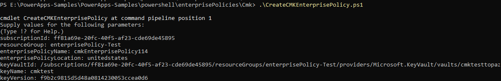</br>

Sample Output : </br>
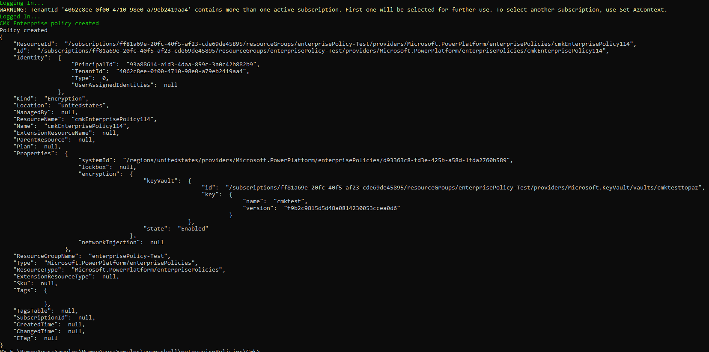</br>

#### Grant enterprise policy permissions to access key vault
2. **Grant enterprise policy permissions to access key vault** : After creating the enterprise policy, you must grant its managed identity access to the key vault. The enterprise policy's managed identity Object ID can be found in the `CreateCMKEnterprisePolicy.ps1` output under `Identity.PrincipalId`, or via the Azure Portal (navigate to the enterprise policy resource → Identity tab).</br>

**If your key vault uses Azure role-based access control (recommended)**:</br>
Assign the **Key Vault Crypto Service Encryption User** role to the enterprise policy's managed identity:
```powershell
New-AzRoleAssignment `
  -ObjectId "<enterprise-policy-PrincipalId>" `
  -RoleDefinitionName "Key Vault Crypto Service Encryption User" `
  -Scope "<key-vault-ARM-resource-id>"
```
Alternatively, in the Azure Portal: Key vaults → select your vault → Access control (IAM) → Add role assignment → search "Key Vault Crypto Service Encryption User" → select the enterprise policy → Review + assign.</br>

**If your key vault uses vault access policy**:</br>
Add an access policy with Get (Key Management Operations), WrapKey and UnwrapKey (Cryptographic Operations):
```powershell
Set-AzKeyVaultAccessPolicy `
  -VaultName "<key-vault-name>" `
  -ObjectId "<enterprise-policy-PrincipalId>" `
  -PermissionsToKeys Get, WrapKey, UnwrapKey
```

> **Note**: RBAC role assignments can take up to 5 minutes to propagate. If you run `ValidateKeyVaultForCMK.ps1` immediately after granting the role, it may report a false failure. Wait a few minutes and retry.</br>

For more details, see [Grant enterprise policy permissions to access key vault](https://learn.microsoft.com/power-platform/admin/customer-managed-key#create-enterprise-policy).</br>

#### Get CMK Enterprise Policy By ResourceId
2. **Get CMK Enterprise Policy By ResourceId** : The script gets a CMK enterprise policy by ARM resourceId</br>
Script name : [GetCMKEnterprisePolicyByResourceId.ps1](./Source/Cmk/GetCMKEnterprisePolicyByResourceId.ps1)</br>
Input parameter :
    - enterprisePolicyArmId : The ARM resource ID of the CMK Enterprise Policy

Sample Input :</br>
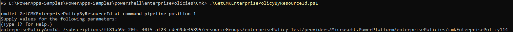</br>

Sample Output :</br>
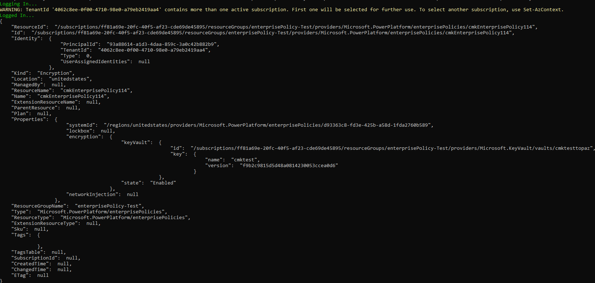</br>

#### Get CMK Enterprise Policies in Subscription
3. **Get CMK Enterprise Policies in Subscription** : The script gets all CMK enterprise policies in an Azure subscription</br>
Script name : [GetCMKEnterprisePoliciesInSubscription.ps1](./Source/Cmk/GetCMKEnterprisePoliciesInSubscription.ps1)</br>
Input parameter :
    - subscriptionId: : The Azure subscription Id

Sample Input :</br>
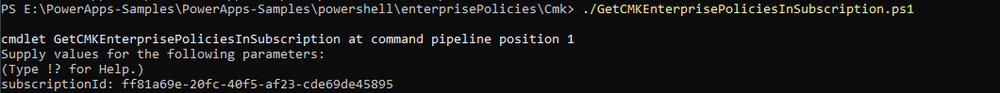</br>

Sample Output :</br>
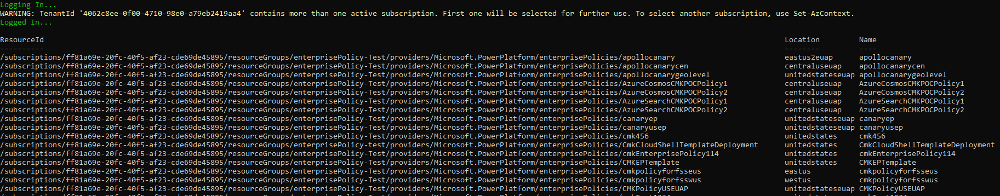</br>

#### Get CMK Enterprise Policies in Resource Group
4. **Get CMK Enterprise Policies in Resource Group** : The script gets all CMK enterprise policies in an Azure resource group</br>
Script name : [GetCMKEnterprisePoliciesInResourceGroup.ps1](./Source/Cmk/GetCMKEnterprisePoliciesInResourceGroup.ps1)</br>
Input parameters :
    - subscriptionId : The Azure subscription Id
    - resourceGroup : The Azure resource group

Sample Input : </br>
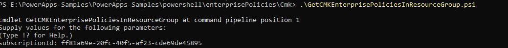</br>

Sample Output :</br>
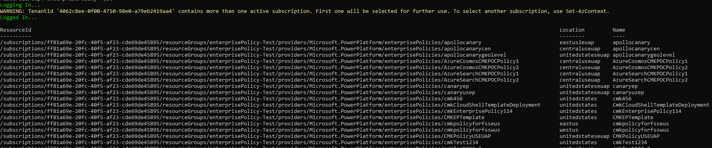</br>

#### Validate Azure Key Vault
5. **Validate Azure Key Vault** : This script checks if the Key Vault is setup correctly according to the pre-requisites required by the Power Platform CMK Enterprise Policy. For details please follow the setup instructions at https://learn.microsoft.com/power-platform/admin/customer-managed-key#create-encryption-key-and-grant-access</br>
	Following major validations are performed:
    - Soft-delete is enabled for key vault: Please follow the instructions at </br>
      https://learn.microsoft.com/azure/key-vault/general/soft-delete-change to update the soft delete property.
    - Purge protection is enabled for key vault: Please follow the istructions at </br>
	  https://learn.microsoft.com/azure/key-vault/general/key-vault-recovery?tabs=azure-portal to get details about enabling Purge Protection</br>
	- "Key Vault Crypto Service Encryption User" role assignment is present for the given enterprise policy if key vault permission model is Azure role based access control.</br>
    - Access policies of GET, UNWRAPKEY, WRAPKEY are added to the key vault for the given enterprise policy if key vault permission model is vault access policy.</br>
	- Key configured for the given enterprise policy is present, enabled, activated and not expired.</br>

> **Tip**: If validation fails on the key vault access policy checks, follow the [Grant enterprise policy permissions to access key vault](#grant-enterprise-policy-permissions-to-access-key-vault) step above to fix the permissions, then re-run this script.</br>
	 

Script name : [ValidateKeyVaultForCMK.ps1](./Source/Cmk/ValidateKeyVaultForCMK.ps1)</br>
Input parameters:
- subscriptionId : The Azure subscription Id of the Key Vault
- keyVaultName : The name of the key Vault
- enterprisePolicyArmId : The CMK enterprise policy ARM Id 

Sample Input : </br>
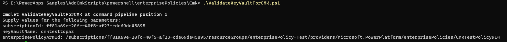</br>

Sample Output :</br>
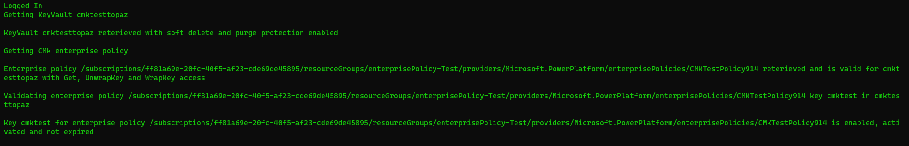</br>

#### Update CMK Enterprise Policy
6. **Update CMK Enterprise Policy** : This script updates a CMK Enterprise Policy. The updates allowed are for keyVaultId, keyName, keyVersion.</br>
If you are changing only some of the allowed parameter values, provide “N/A” when prompted for the parameters that you don’t want to change.</br>
 **If the enterprise policy is associated with one or more environments, the update operation will fail, and the script will return an error.**</br>
Script name : [UpdateCMKEnterprisePolicy.ps1](./Source/Cmk/UpdateCMKEnterprisePolicy.ps1)</br>
Input parameters :
    - subscriptionId : The Azure subscription Id of the CMK Enterprise Policy
    - resourceGroup : The Azure resource group of the CMK Enterprise Policy
    - enterprisePolicyName : The name of the CMK enterprise policy that needs to be updated
    - keyVaultId : The ARM resource ID of the key vault if it needs to be updated. Provide "N/A" if update is not required for key vault Id
    - keyName: The name of the key if it needs to be updated. Provide "N/A" if update is not required for name of the key
    - keyVersion: The version of the key if it needs to be updated. Provide "N/A" if update is not required for version of the key

Sample Input : </br>
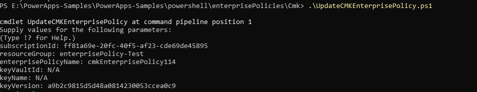</br>

Sample Output :</br>
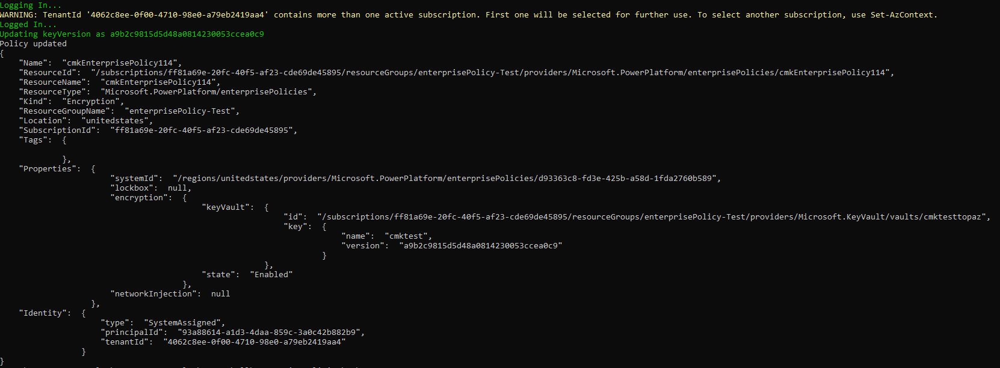</br>

#### Delete CMK Enterprise Policy
7. **Delete CMK Enterprise Policy** : This script deletes the CMK Enterprise Policy for a given policy Id. </br>
**If the CMK enterprise policy is associated with one or more environments, the delete operation will fail, and the script will return an error.**</br>
Script name : [RemoveCMKEnterprisePolicy.ps1](./Source/Cmk/RemoveCMKEnterprisePolicy.ps1)</br>
Input parameter :
    - policyArmId : The ARM ID of the CMK enterprise policy to be deleted

Sample Input : </br>
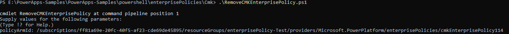</br>

Sample Output :</br>
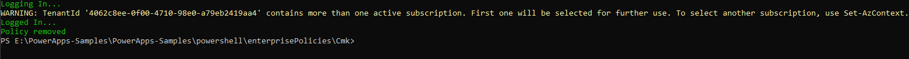</br>

#### Set CMK for an environment
8. **Set CMK for an environment** : This script applies a CMK enterprise policy to a given Power Platform environment.</br>
The script adds the environment to the enterprise policy and optionally polls for the operation outcome.</br>
Script name : [AddCustomerManagedKeyToEnvironment.ps1](./Source/Cmk/AddCustomerManagedKeyToEnvironment.ps1)</br>
Input parameters :
    - environmentId : The Power Platform environment ID
    - policyArmId : The ARM ID of the CMK Enterprise Policy

> **Prerequisites for Power Platform Admin Center users**:</br>
> Before adding an environment to a CMK enterprise policy via the Power Platform Admin Center:</br>
> 1. The environment must be enabled as a [Managed Environment](https://learn.microsoft.com/power-platform/admin/managed-environment-enable).</br>
> 2. The Power Platform / Dynamics 365 admin must have the **Reader** role on the enterprise policy Azure resource:</br>
>    `New-AzRoleAssignment -ObjectId <PP-admin-object-id> -RoleDefinitionName Reader -Scope <EP-ARM-resource-id>`</br>
>    To find the admin's Object ID: Azure Portal → Microsoft Entra ID → Users → select user → copy Object ID.</br>
> See [Microsoft Learn: CMK prerequisites](https://learn.microsoft.com/power-platform/admin/customer-managed-key#create-encryption-key-and-grant-access) for details.

Sample Input :</br>
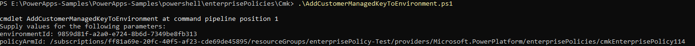</br>

Sample Output :</br>
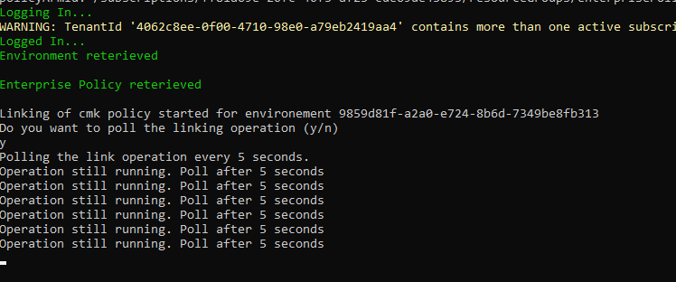</br>

#### Get CMK for an environment
9. **Get CMK for an environment** : This script returns the CMK enterprise policy if applied to a given Power Platform environment.</br>
Script name : [GetCMKEnterprisePolicyForEnvironment.ps1](./Source/Cmk/GetCMKEnterprisePolicyForEnvironment.ps1)</br>
Input parameter :
    - environmentId : The Power Platform environment ID

Sample Input :</br>
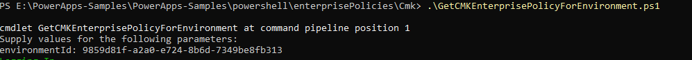</br>

Sample Output :</br>
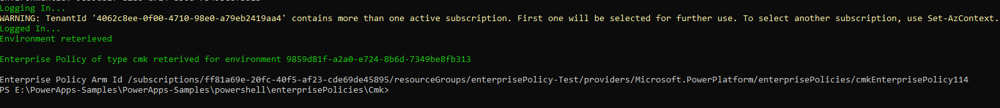</br>

#### Remove CMK from an environment
10. **Remove CMK from an environment** : The script removes the CMK enterprise policy from an environment, </br>
which results on data to be encrypted with a Microsoft managed encryption key.</br>
Script name : [RemoveCustomerManagedKeyFromEnvironment.ps1](./Source/Cmk/RemoveCustomerManagedKeyFromEnvironment.ps1)</br>
Input parameters :
    - environmentId : The Power Platform environment ID
    - policyArmId: The ARM ID of the CMK Enterprise Policy

Sample Input :</br>
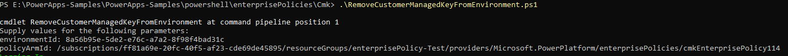</br>

Sample Output :</br>
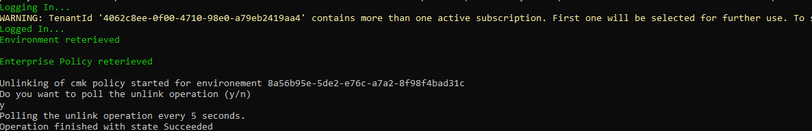</br>

### How to run Identity scripts

The Identity scripts are present in folder [Identity](./Source/Identity/) at current location.

> **Note**: These scripts are legacy scripts that may be replaced by the Microsoft.PowerPlatform.EnterprisePolicies module in the future. Use module cmdlets when available.

#### Create Identity Enterprise Policy
1. **Create Identity Enterprise Policy** : This script creates an Identity enterprise policy.</br>
Script name : [CreateIdentityEnterprisePolicy.ps1](./Source/Identity/CreateIdentityEnterprisePolicy.ps1)</br>
Input parameters :
    - subscriptionId : The subscriptionId where Identity enterprise policy needs to be created
    - resourceGroup : The resource group where Identity enterprise policy needs to be created
    - enterprisePolicyName : The name of the Identity enterprise policy resource
    - enterprisePolicyLocation : The Azure geo where Identity enterprise policy needs to be created

#### Get Identity Enterprise Policy by ResourceId
2. **Get Identity Enterprise Policy by ResourceId** : The script gets an Identity enterprise policy by ARM resourceId.</br>
Script name : [GetIdentityEnterprisePolicyByResourceId.ps1](./Source/Identity/GetIdentityEnterprisePolicyByResourceId.ps1)</br>
Input parameter :
    - enterprisePolicyArmId : The ARM resource ID of the Identity Enterprise Policy

#### Get Identity Enterprise Policies in Subscription
3. **Get Identity Enterprise Policies in Subscription** : The script gets all Identity enterprise policies in an Azure subscription.</br>
Script name : [GetIdentityEnterprisePoliciesInSubscription.ps1](./Source/Identity/GetIdentityEnterprisePoliciesInSubscription.ps1)</br>
Input parameter :
    - subscriptionId : The Azure subscription Id

#### Get Identity Enterprise Policies in Resource Group
4. **Get Identity Enterprise Policies in Resource Group** : The script gets all Identity enterprise policies in an Azure resource group.</br>
Script name : [GetIdentityEnterprisePoliciesInResourceGroup.ps1](./Source/Identity/GetIdentityEnterprisePoliciesInResourceGroup.ps1)</br>
Input parameters :
    - subscriptionId : The Azure subscription Id
    - resourceGroup : The Azure resource group

#### Assign Identity to an environment
5. **Assign Identity to an environment** : This script assigns an Identity enterprise policy to a Power Platform environment.</br>
Script name : [NewIdentity.ps1](./Source/Identity/NewIdentity.ps1)</br>
Input parameters :
    - environmentId : The Power Platform environment ID
    - policyArmId : The ARM ID of the Identity Enterprise Policy
    - endpoint _(optional)_ : The BAP endpoint (default: prod). Valid values: tip1, tip2, prod, usgovhigh, dod, china

#### Get Identity Enterprise Policy for an environment
6. **Get Identity Enterprise Policy for an environment** : This script returns the Identity enterprise policy if applied to a given Power Platform environment.</br>
Script name : [GetIdentityEnterprisePolicyForEnvironment.ps1](./Source/Identity/GetIdentityEnterprisePolicyForEnvironment.ps1)</br>
Input parameters :
    - environmentId : The Power Platform environment ID
    - endpoint _(optional)_ : The BAP endpoint (default: prod)

#### Swap Identity for an environment
7. **Swap Identity for an environment** : This script swaps the Identity enterprise policy on a given Power Platform environment.</br>
Script name : [SwapIdentity.ps1](./Source/Identity/SwapIdentity.ps1)</br>
Input parameters :
    - environmentId : The Power Platform environment ID
    - newPolicyArmId : The ARM ID of the new Identity Enterprise Policy
    - endpoint _(optional)_ : The BAP endpoint (default: prod)

#### Remove Identity from an environment
8. **Remove Identity from an environment** : This script removes the Identity enterprise policy from a Power Platform environment.</br>
Script name : [RevertIdentity.ps1](./Source/Identity/RevertIdentity.ps1)</br>
Input parameters :
    - environmentId : The Power Platform environment ID
    - policyArmId : The ARM ID of the Identity Enterprise Policy
    - endpoint _(optional)_ : The BAP endpoint (default: prod)

#### Delete Identity Enterprise Policy
9. **Delete Identity Enterprise Policy** : This script deletes an Identity Enterprise Policy.</br>
Script name : [RemoveIdentityEnterprisePolicy.ps1](./Source/Identity/RemoveIdentityEnterprisePolicy.ps1)</br>
Input parameter :
    - policyArmId : The ARM ID of the Identity enterprise policy to be deleted

## Development

To get started with development, clone the repository and open it in VSCode. The scripts are written in PowerShell and follow standard PowerShell conventions.

Please place any common functions in the `Private` folder, and any module-level functions that are going to be exposed in the `Public` folder.

In order to run tests, please ensure you do the following from the repository root:

```powershell
# You might need the --interactive flag
dotnet restore
```

> [!NOTE]
> If you are not a Microsoft employee, you will need to modify the Nuget.config file to point to the public NuGet repository.

Then, you can enable running the tests by going to the Run and Debug view in VSCode and selecting and running the `Load Modules` script. This will load the necessary modules and allow you to run the tests.

> [!NOTE]
> You should clear out any Pester installations, as the tests are written using the latest version of Pester.

## FAQ

### General FAQ

#### Unable to add/remove EP to/from environment due to "Error getting environment"
* StatusCode: 404 
* ErrorMessage contains: *The environment '\<guid\>' could not be found in the tenant...*
* **Solution**: Ensure the user has the `Power Platform Administrator` (or equivalent) role

### Subnet Injection FAQ

#### Unable to delete VNet / Unable to modify subnet
* ErrorCode: `InUseSubnetCannotBeDeleted` or `SubnetMissingRequiredDelegation`
* ErrorMessage contains: *.../serviceAssociationLinks/PowerPlatformServiceLink...*
* **Solution**: delete the Subnet Injection enterprise policy firs with [Remove-SubnetInjectionEnterprisePolicy](./docs/en-US/Microsoft.PowerPlatform.EnterprisePolicies/Remove-SubnetInjectionEnterprisePolicy.md)

### CMK FAQ

**Q: I created a CMK Enterprise Policy but get a 403 / Forbidden error when the service accesses my Key Vault. What do I do?**</br>
A: After creating the CMK enterprise policy, Azure creates a managed identity for it. This identity needs **Key Vault Crypto Service Encryption User** role (or the legacy Wrap/Unwrap key permissions in vault access policy) on your Key Vault. See [Microsoft Learn: Grant access](https://learn.microsoft.com/power-platform/admin/customer-managed-key#create-encryption-key-and-grant-access). Find the managed identity Object ID in the Azure Portal under the enterprise policy resource → Identity blade, then grant access:
```powershell
# For RBAC (recommended):
New-AzRoleAssignment -ObjectId <EP-managed-identity-object-id> `
    -RoleDefinitionName "Key Vault Crypto Service Encryption User" `
    -Scope "/subscriptions/<sub>/resourceGroups/<rg>/providers/Microsoft.KeyVault/vaults/<vault>"
```

**Q: The scripts authenticate to the wrong Azure subscription. How do I fix this?**</br>
A: The scripts call `Connect-AzAccount` which defaults to your last-used subscription. Use one of these approaches:
```powershell
# Option 1 — Set default subscription before running scripts:
Update-AzConfig -DefaultSubscriptionForLogin <your-subscription-id>

# Option 2 — Pre-authenticate with a specific subscription:
Connect-AzAccount -Subscription <your-subscription-id>
```

**Q: I get a "file is not digitally signed" error running the scripts. What should I do?**</br>
A: After downloading or cloning the repository, Windows may block the files. Right-click each .ps1 file → Properties → check "Unblock", or run:
```powershell
Get-ChildItem -Path . -Recurse -Filter *.ps1 | Unblock-File
```

**Q: The "Validate Key Vault" step fails even though my Key Vault exists. What went wrong?**</br>
A: Common causes include: (1) the Key Vault key is not enabled or has expired, (2) soft-delete and purge-protection are not enabled on the Key Vault, (3) the managed identity does not have the correct permissions (see first FAQ above). Verify all requirements at [Microsoft Learn: Create encryption key and grant access](https://learn.microsoft.com/power-platform/admin/customer-managed-key#create-encryption-key-and-grant-access).
